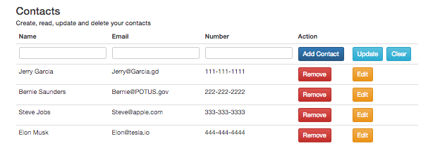

	
	<h3>Simple MEAN Stack Contacts App</h3>
		
After download run npm install, start node server $node server

	<ul>
		<li>MongoDB</li>
		<li>Express</li>
		<li>Angular</li>
		<li>Node</li>
		<li>Bootstrap</li>
	</ul>
	
@tytowry

	
linkedin.com/in/tytowry

